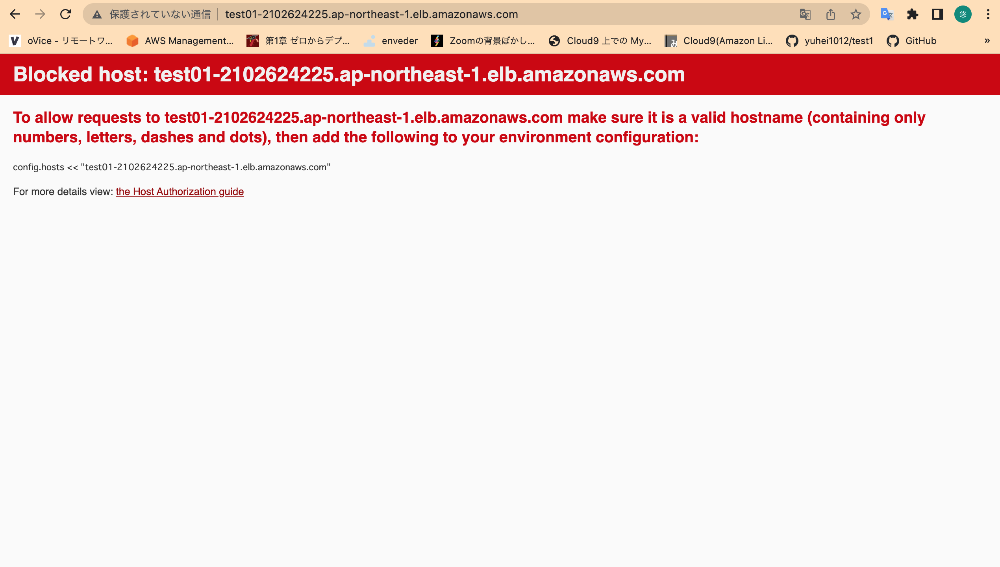

ELBの追加

# 参考サイト
https://zenn.dev/ito110/scraps/5031f7ce7b92cf

https://dev.classmethod.jp/articles/sales-ec2-elb-session/

https://nishinatoshiharu.com/ec2-with-alb-setting/#_EC2nginx

エラー時の閲覧サイト
https://zenn.dev/tikka/articles/6109990725a0f417d058

# ロードバランサーの　DNSNameをブラウザに入力後

# ロードバランサー追加時にハマったエラー

・ターゲットグループのHealth statusでunhealthy

# エラー解消
設定後にnginxとunicornを再起動してみたらhealthyとなり解消した
*再起動をしないでエラーコードを延々調べて時間を要してしまった。
