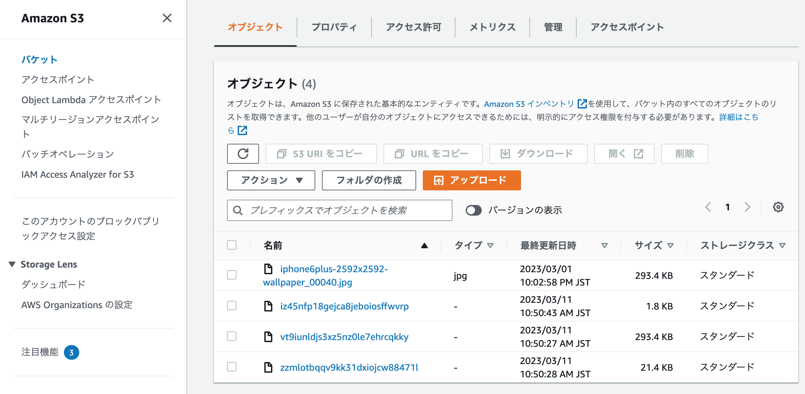

# S3追加

 S3バケット作成　参考サイト
# https://qiita.com/miriwo/items/41e488b79fb58fa7c952

# S3設定参考サイト

## https://yuukii5.hatenablog.com/entry/2020/11/16/205404
## https://zenn.dev/kurao/articles/ce8e583450c76e
## https://qiita.com/daichi41/items/af2a56ea46c13ca55fd3
## https://qiita.com/zenfumi/items/4a7cbab59f0f7ede0d6e
## https://qiita.com/daichi41/items/af2a56ea46c13ca55fd3
## https://qiita.com/NaokiIshimura/items/2a179f2ab910992c4d39
## https://qiita.com/kinopyyy/items/340b048d3343904119c8
## https://techtechmedia.com/multi-environment-credentials/
## https://qiita.com/NaokiIshimura/items/2a179f2ab910992c4d39

## 　S3への画像追加

## ハマったエラー

# nginxのerror.log ⇒/var/lib/nginx/tmp/client_body/0000000001" failed (13: Permission denied)
nginxにおける権限が足りないというエラーであった。

# 解決に至ったサイト
https://qiita.com/haljion/items/edc1225e40956d90ed49

権限がたりないということだったので、userをec2-user→rootに変更後nginxを再起動した所、エラーが解消された。

## その他S3追加の際に感じたポイント
# credentials.yml.encの設定
# Active storageの設定

### 　$ rails c コマンドでnilが返ってくる

### credentialsのエラー

## rails cでnilが返るのはcredentialsファイルのインデントがどこか崩れていたこと

