### cloudformationによる環境構築

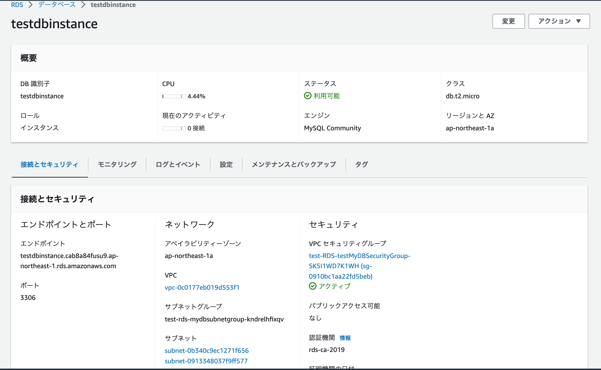

### Network

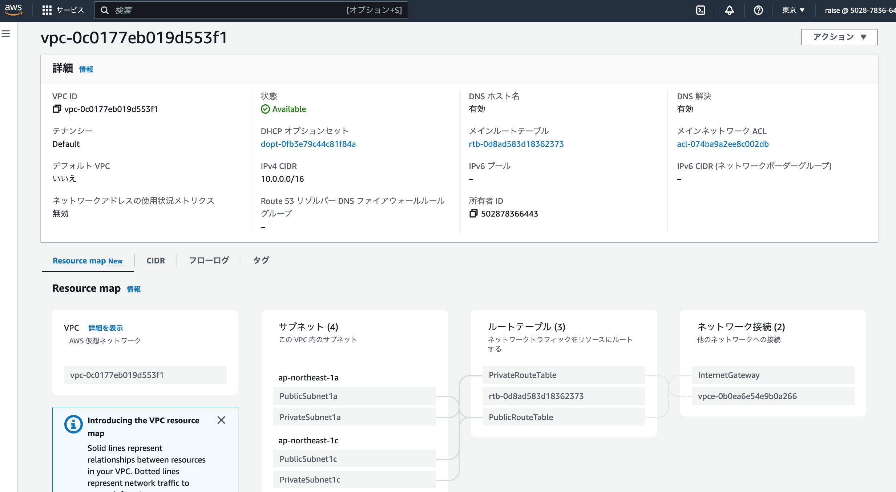
 

### EC2

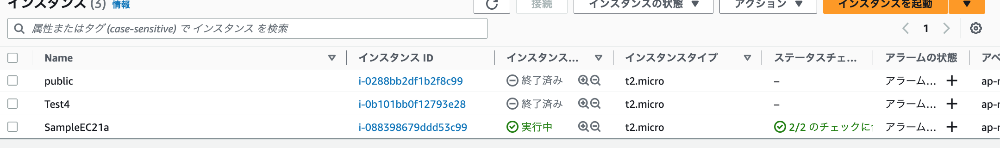

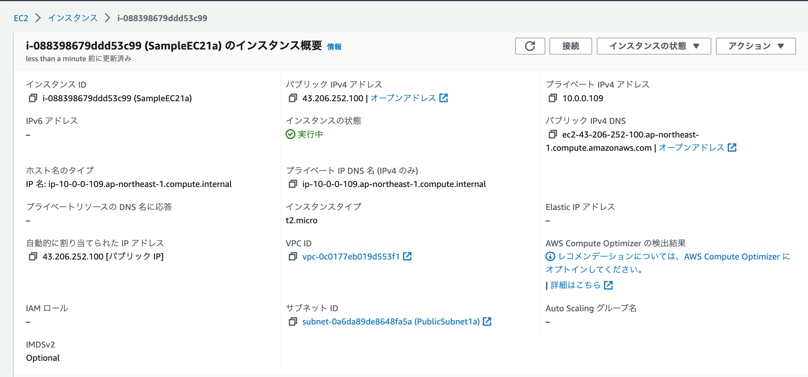

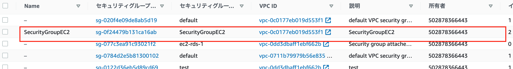

### RDS

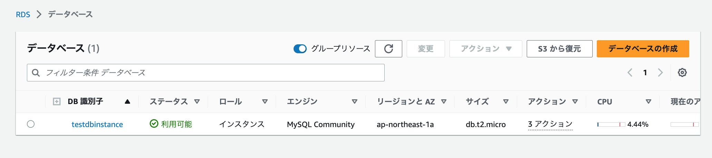

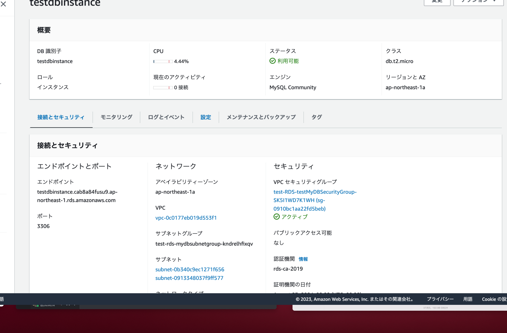

### ALB

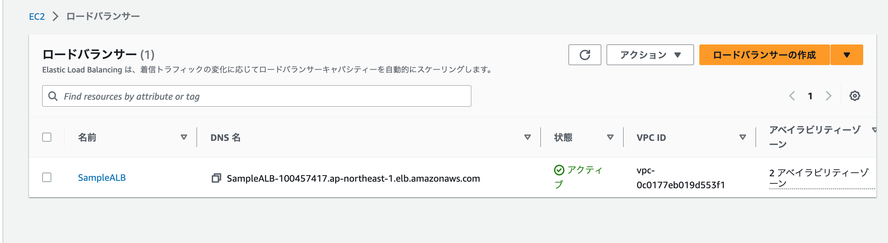

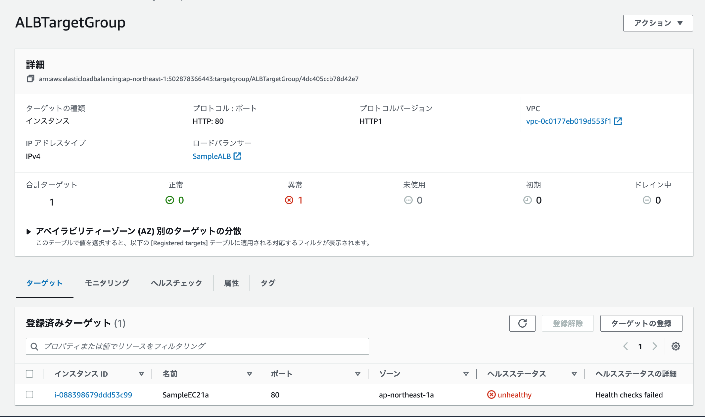

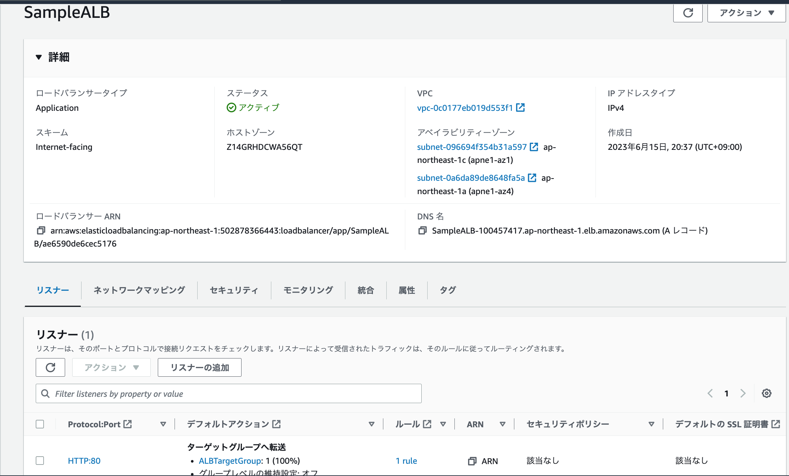

### S3

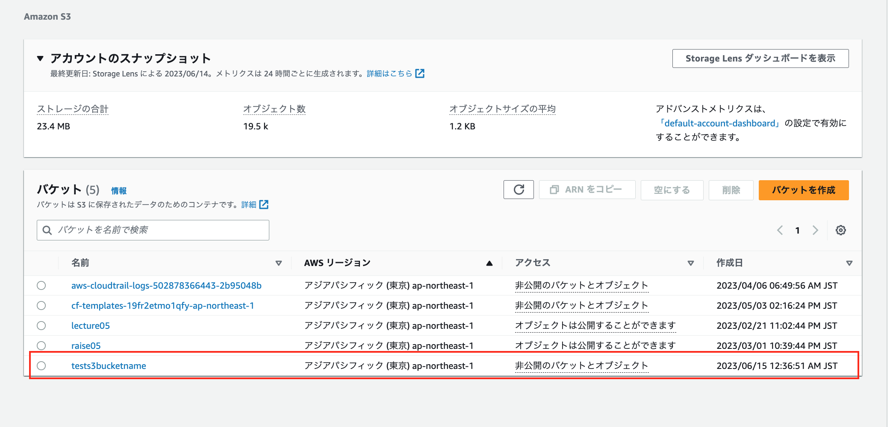

今回はインデントのエラーであったり、Valueエラーが多く発生した。
Outputsの設定をしなかったりと必須の項目での躓きが多かった。
参考になるサイトはあったが自分にとってどこが不要でどこが必要かを読み解くのに時間が掛かってしまった。

