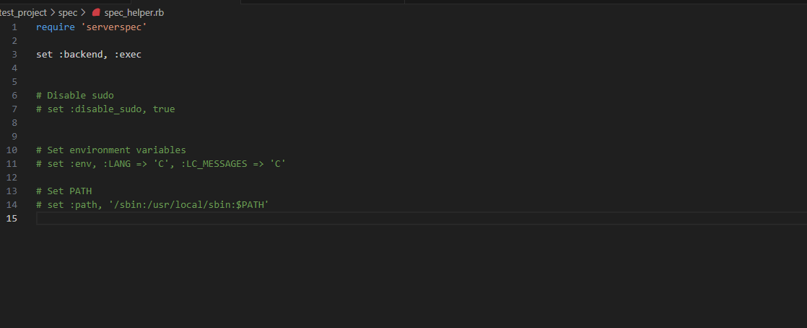

# serverspecの実施

久々に再開したのでインスタンスも何もなく最初からの作成となった。
Rubyのインストールが上手くいかず質問したとろAmazon Linux2023では動作保証していないとのことだったので
Amazon Linux2で作成した所うまくいった。

## serverspecのインストール

#### severspecのTopページ
 https://serverspec.org/

#### 他インストール参照
https://qiita.com/hitomatagi/items/12f9f10ff8e95dbe0999

$ serverspec-initコマンド実行

Select OS type:

  1) UN*X
  2) Windows

Select number: 1

Select a backend type:

  1) SSH
  2) Exec (local)

Select number: 2

 + spec/
 + spec/localhost/
 + spec/localhost/sample_spec.rb
 + spec/spec_helper.rb
 + Rakefile
 + .rspec

＊今回はローカルなのでSelect a backend typeはExec(local)を選択する

## テスト項目を記述しテスト実行

ポート確認

項目入力

spec_helper.rbファイル

テスト成功

### テスト失敗

railsのバージョンを異なるものにした時のテスト失敗画面

### rake specコマンドエラー　テスト自体ができないエラー

テスト自体のエラーの原因は最初のserverspec-initコマンド実行時にsshかlocalかを選択する際にsshを選択してしまったことが原因である。
一つのec2マシンで実行する際はlocalを選択するべきであった。
久々に課題を再開したので動作がしないosがあったりとしたがまた継続して完走を目指す。
sshを接続する時は下記のように複数のインスタンスで実する時である。

# 総括

テスト実行時のエラーはec2にsshでログインしているのでsshだろうと選択してしまったが結果的にそれが問題でエラーが出てしまった。
一から見直し、この選択はどういう意味かを調べながら進めていった方が余計なエラーは出なかったと思うがこれも経験として蓄積できた。
また、今回初めてchatgptを使用してみたが、上手く活用できいるかはまだ分からない。

### chatgptのやり取り

https://chatgpt.com/g/g-PGPnMa4Ph-ri-ben-yu-rokuin/c/ccfec11d-1d21-4114-af93-38c9bb7be0e9
