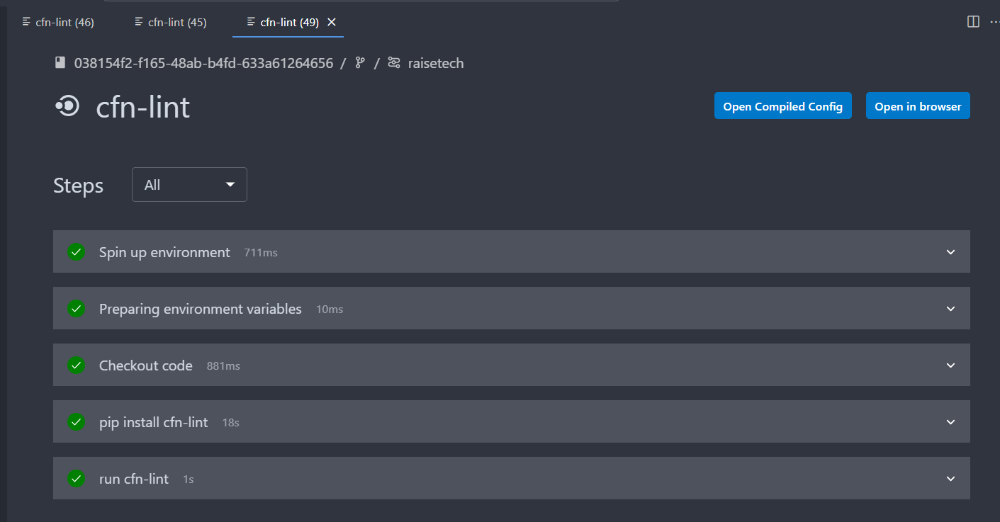
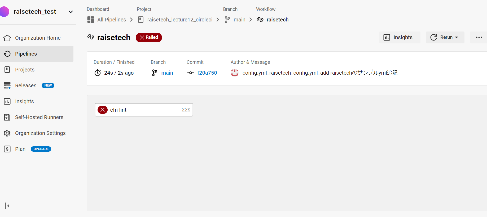
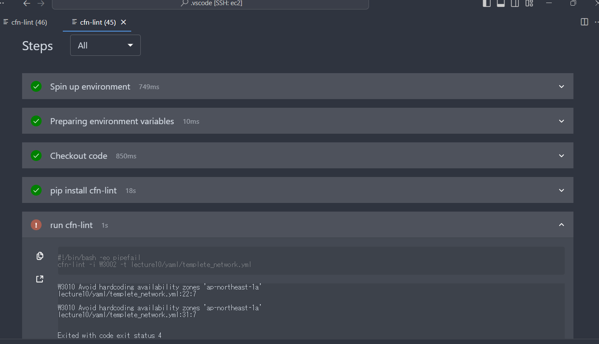

## 第12回　circleci

CI/CD ツールとは「Continuous Integration/Continuous Delivery」の略称

継続的な価値提供、継続的なリリースを維持するという意味

環境構築のコストも低く、手軽に導入できる


#### circleciのtopページ
https://circleci.com/ja/


Raise techサンプルconfig.yml

````
version: 2.1
orbs:
  python: circleci/python@2.0.3
jobs:
  cfn-lint:
    executor: python/default
    steps:
      - checkout
      - run: pip install cfn-lint
      - run:
          name: run cfn-lint
          command: |
            cfn-lint -i W3002 -t cloudformation/*.yml

workflows:
  raisetech:
    jobs:
      - cfn-lint
````


#### 修正yaml構文

````

version: 2.1
orbs:
  python: circleci/python@2.0.3
jobs:
  cfn-lint:
    executor: python/default
    steps:
      - checkout
      - run: pip install cfn-lint
      - run:
          name: run cfn-lint
          command: |
            cfn-lint -i W3002 -t lecture10/yaml/lecture12_test_cfn.yml

workflows:
  raisetech:
    jobs:
      - cfn-lint
````

###### circleciワークフロー成功



###### circleciワークフロー失敗




##### ハードコーティングエラー




###### ワークフローが失敗した原因
ワークフローのエラーでハマってしまった。

原因はconfig.yml構文のエラーであった。

最後の行の  cfn-lint -i W3002 -tの後に続く構文が原因であった。

yamlファイルの場所を明示することが必須であったが、ファイルのあるディレクトリのパスが間違っていたり、ディレクトリの名前が間違っていたことが原因であった。
そのためテンプレートが無いというエラーが発生してしまった。

###### ハードコーティングエラー
ハードコーティングとはソースコードに直接書き込むことである。

今回の件だとcfnのテンプレートに直接アベイラビリティーゾーンを書き込んだことでエラーになった。
解消するにはパラメーターの事前設定や関数を組み込むで解消できた。
そもそもハードコーティングの何がダメなのかよく理解してなかったがコードの柔軟性が失われたり、メンテナンスの煩雑化、バグ発生のリスク等があるためとあった。

下記のURLが参考になった。


[ハードコーティングについて](https://teams.qiita.com/hard-coding-meaning-avoidance-beginner-guide/#:~:text=%E3%83%8F%E3%83%BC%E3%83%89%E3%82%B3%E3%83%BC%E3%83%87%E3%82%A3%E3%83%B3%E3%82%B0%E3%81%AF%E3%81%AA%E3%81%9C%E3%81%A0%E3%82%81%E3%81%AA%E3%81%AE%E3%81%8B&text=%E3%81%BE%E3%81%9A%E3%80%81%E3%82%B3%E3%83%BC%E3%83%89%E3%81%AE%E6%9F%94%E8%BB%9F%E6%80%A7,%E3%81%8C%E9%AB%98%E3%81%BE%E3%82%8B%E6%81%90%E3%82%8C%E3%81%8C%E3%81%82%E3%82%8A%E3%81%BE%E3%81%99%E3%80%82)


ハードコーティングエラー解消参考URL

[ハードコーティングエラー解消参考](https://dev.classmethod.jp/articles/cfn-availavility-zone-notation/)


      


