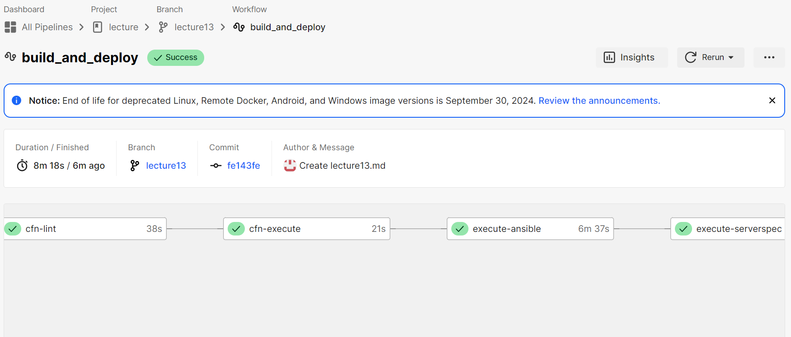
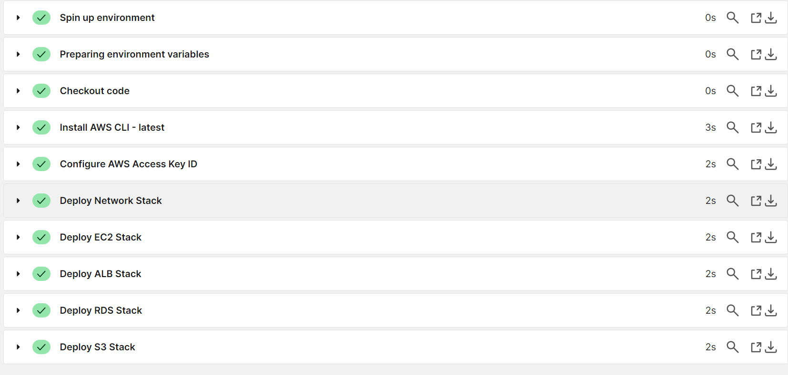
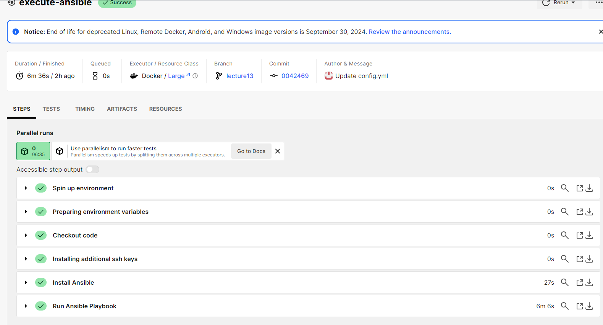
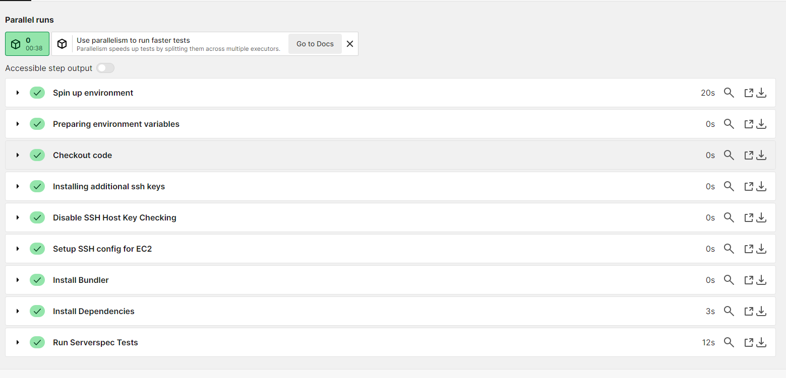
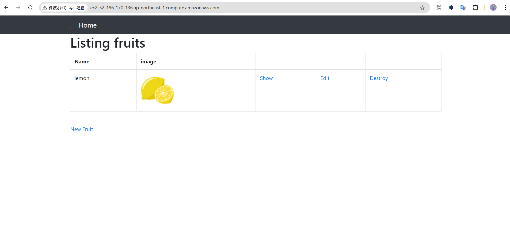

# 第13回　CircleCiを活用した自動化

- CI/CDツールを使用してセットアップから構築、デプロイ、serverspecを使用してテスト実行までを自動化

- CircleCiを使用しCFnでリソースを作成、作成されたリソースにAnsibleでRails環境とアプリケーションのセットアップ、最後にserverspecでテストを実行する構成となる。

### CircleCiでの作成画面

### CFn成功

### Ansible成功

### Serverspec成功

### アプリケーション画像確認

## 総括
今回の課題はかなりの時間を要することとなり、難しい課題であった。
最初はlocalでAnsibleを成功させるところから始めたが、これも中々うまくいかず苦労をした。
しかしできてしまえば10分程で作成、デプロイ、テストが実行できるので非常に便利なツールであると感じた。
業務として使用できるレベルではないのでまだまだ学習は継続していきたい。

# 構成図

