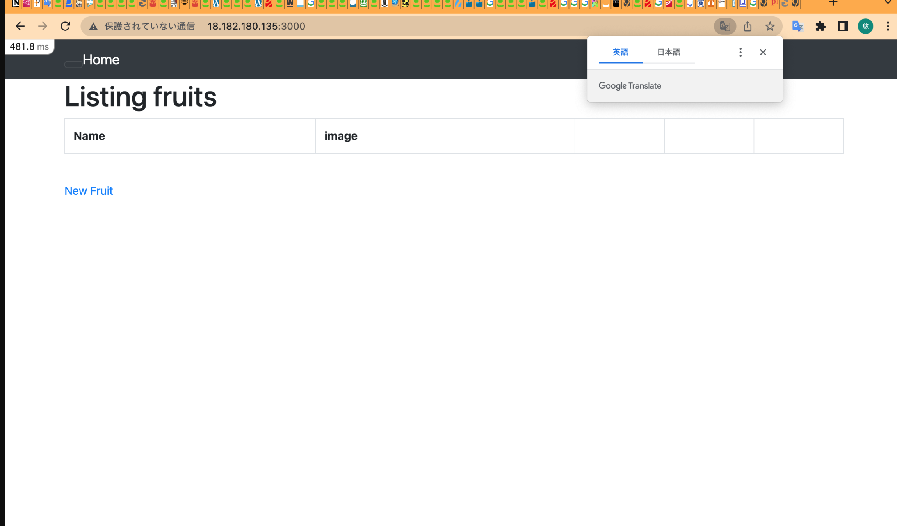

# Nginx,unicornのインストール(今回はunicornはインストール済）

参考サイト

## https://qiita.com/e-onm/items/0814b6c4db395e331df1

## https://qiita.com/miriwo/items/56f746e4f9b7eac75d6b

## https://motolog.me/amazonlinux2-rails-nginx-unicorn/

# 起動画面 
#### 組み込みサーバー動作確認と同一の画像を使用

nginx起動・停止参考サイト
## https://gakumon.tech/nginx/nginx_service.html
unicorn起動・停止参考サイト
## https://blog.naichilab.com/entry/2015/12/05/230828

　# nginxとunicornはapp階層で実行すること！
　
# ハマったエラー

設定後Elastic IPをブラウザで確認したが下記の画像となった

原因はnginxとunicornの起動コマンドを正しい階層で実行していないからだった
ec2のapp階層ではなく[ec2-user@ip-172-31-39-23 ~]で起動させていた。

そのため下記エラーが発生していた

原因が分からず設定に関するサイトばかり調べていたが一向に解決できなかった。

確認していたサイト

## https://qiita.com/Takao_/items/e7d3c79154a817625b95

## https://qiita.com/kodai_0122/items/c4c13e89dd5c4cba1f32

## https://qiita.com/naota7118/items/4fe2578fec561795a960

## https://qiita.com/tabimoba/items/858f63dab61d03287385

## https://qiita.com/Dragon-taro/items/fcd987f27c718627f123

